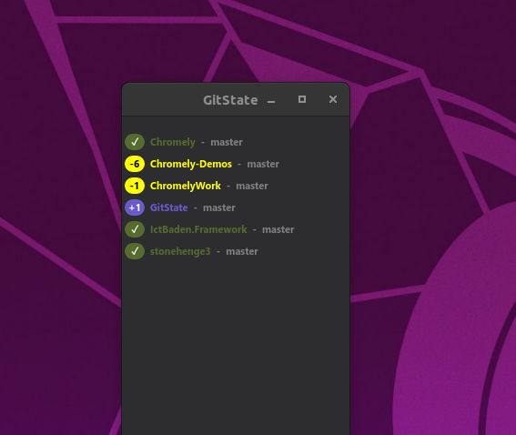
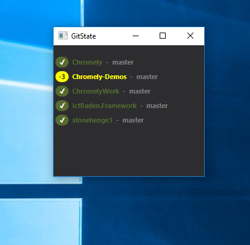

# GitState
State display for folders of git repositories

Working with a lot of repositories on different VMs every day sometimes i lost the overview.
Writing cross platform applications it is necessary to verify it is running on all - which is not quite natural!   
So more than once i made changes on two platforms at the same time. The sync is the git repo, and a lot of times i ran into my own merge conflicts. Looking for a tool showing the state of ALL repositories i found nothing, so the idea for this tool arises.

Simple configuration using [GitState.cfg](Configuration.md).

Now it is here and i am glad learned so many things writing it.  

    

## Eat your own dog food...
This project is a good example of it.

Using my own libraries i had a lot of insights about my own libraries.

* how to use - is there a documentation? - still not :-(
* are there tests for every functionality - increasing...
* is it usable as expected - not everywhere - improving...

## Releases
Currently available [v1.1.1](https://github.com/FrankPfattheicher/GitState/releases) for Windows-x64 and Linux-x64

Just download, unpack in an GitState folder, edit [GitState.cfg](Configuration.md) for your needs.

## Used Nuget Packages

**LibGit2Sharp** https://github.com/libgit2/libgit2sharp

**Stonehenge** https://github.com/FrankPfattheicher/Stonehenge4

**IctBaden.Framework** https://github.com/FrankPfattheicher/IctBaden.Framework

and dependencies of that ...
